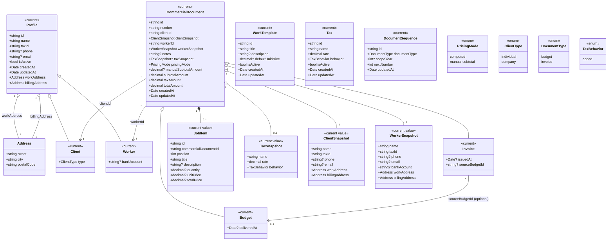

# Domain Class Diagram

This document captures the complete current + planned domain model for the platform.

- Current entities come from the implemented profile and commercial-document model.
- Planned notes are retained only where explicitly not yet implemented.

## UML Class Diagram

## Notes

- `CommercialDocument` is a domain abstraction decision, not necessarily a physical base table in this phase.
- **Snapshot classes** (`ClientSnapshot`, `WorkerSnapshot`, `TaxSnapshot`) are value objects embedded directly in budget/invoice documents as flat fields.
  - They preserve historical correctness: data materialized at document creation time remains unchanged even if source definitions later change.
  - In persistence, snapshots are stored as flat columns or document-owned sub-rows, not as independent reusable tables.
- `WorkTemplate` is part of the document catalog for reuse, but line items do not maintain references to templates (materialized content only).
- `TaxBehavior` is currently `added` only in this phase and can be extended later.
