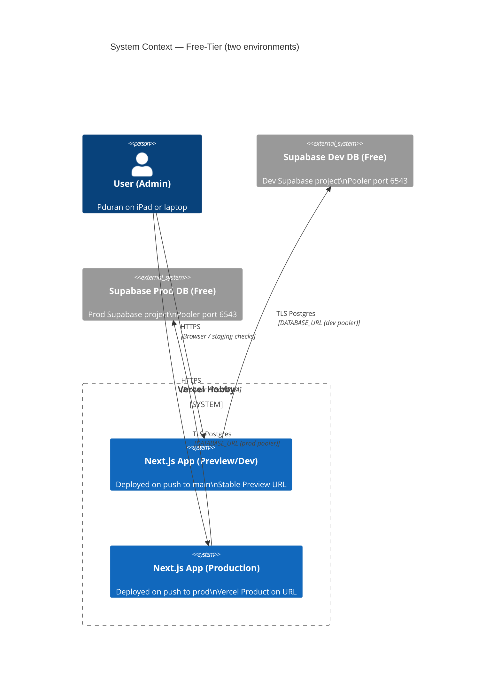

## Context

The app is a Next.js monorepo (`apps/web`) with serverless Route Handlers serving both the UI and REST API. ADR 0001 established this architecture and it is the only in-force ADR. The local stack uses Docker Compose + PostgreSQL. No production environment exists yet. The immediate goal is to ship to free-tier cloud infrastructure with zero new paid dependencies.

Current known state:
- `apps/web` builds with `next build`; `turbo build` orchestrates the monorepo.
- `DATABASE_URL` is the only required runtime env var (used by the `pg` client in Route Handlers).
- Swagger UI lives at `/api/docs`; OpenAPI JSON at `/api/docs/openapi`. Both are served by Next.js Route Handlers.
- Health endpoints at `/api/health` and `/api/health/connectivity`.
- No committed Vercel project config exists yet, and no PWA manifest exists.
- Migrations are SQL files run manually (no automated migration runner wired to production deploy yet).

## Architecture Diagrams



## Goals / Non-Goals

**Goals:**
- Deploy the existing Next.js app to Vercel Hobby with zero code changes to the REST API or OpenAPI contract.
- Connect production runtime to Supabase free-tier Postgres via environment variables.
- Make the web app installable as a PWA on iPad (Add to Home Screen).
- Provide a repeatable, documented deployment procedure including account setup and validation steps.
- Accept all free-tier operational constraints (cold starts, row limits, monthly bandwidth).

**Non-Goals:**
- Google Drive integration or document pipeline.
- Paid infrastructure of any kind in this phase.
- Automated CI/CD pipeline (Vercel Git integration provides this for free once connected).
- Custom domain (optional post-deployment step, not required for validation).

## Decisions

### Decision 1: Vercel as the app/API host, with `prod` branch as production

**Choice:** Vercel Hobby (free tier), with the Vercel production branch set to `prod` (not `main`).

**Rationale:** Next.js is Vercel-native; Route Handlers deploy as Edge/Node serverless functions with no additional config. Zero-config monorepo detection via `apps/web`. Free tier covers low-traffic personal tools comfortably.

**Branch → environment mapping:**

| Git event | Vercel environment | Database |
|---|---|---|
| Push / merge to `main` | Preview (stable dev URL) | Dev Supabase project |
| Merge `main` → `prod` | Production | Prod Supabase project |
| Feature branch push | Preview (ephemeral URL) | Dev Supabase project |

Setting the Vercel production branch to `prod` means merges to `main` auto-deploy to a stable, permanent Preview URL that acts as the dev environment. Promotion to production is a conscious manual step: merge `main` into `prod`.

**Promoting to production:**
```bash
git checkout prod && git merge main && git push
```

**What's needed:**
- Create a `prod` long-lived branch in the repo.
- Set Vercel project → Settings → Git → Production Branch to `prod`.
- Vercel project settings configured to use `apps/web` as the root directory.
- Vercel project linked to the GitHub repo.
- `DATABASE_URL` set separately per Vercel environment (Preview → dev DB, Production → prod DB).

### Decision 2: Two Supabase free-tier Postgres projects (dev + prod)

**Choice:** Two separate Supabase Free Plan projects — one for dev, one for prod. Supabase Free allows up to 2 active projects.

**Rationale:** Full environment isolation with no extra cost. The dev Supabase project is pointed at by Vercel Preview deployments; the prod project by Vercel Production. This prevents any dev deploy from ever touching prod data.

**Per project, two connection strings are required:**
- `DATABASE_URL` → pooler URL (`postgres://...@aws-0-<region>.pooler.supabase.com:6543/postgres?pgbouncer=true`) — set in Vercel per environment (Preview → dev URL, Production → prod URL).
- `DIRECT_URL` → direct URL (`postgres://...@db.<project-ref>.supabase.co:5432/postgres`) — developer-machine-only secret, used to run migrations. Never set in Vercel.

**Migration strategy:** Manual execution from a developer machine using a documented script. Migrations are run against the target environment's `DIRECT_URL` before or immediately after deploying. No automated migration runner in this phase.

```bash
# Run against dev
psql "$DEV_DIRECT_URL" -f <migration-file>.sql

# Run against prod (before promoting)
psql "$PROD_DIRECT_URL" -f <migration-file>.sql
```

The README will document this step-by-step with exact variable names and where to find each URL in the Supabase dashboard.

### Decision 3: PWA installability via static manifest

**Choice:** Add `apps/web/public/manifest.json` and link it from `app/layout.tsx` with `<link rel="manifest">` plus `theme-color` and `apple-mobile-web-app-capable` meta tags.

**Rationale:** Minimal implementation — no service worker, no offline mode. The goal is iPad "Add to Home Screen" support, which only requires a manifest with `name`, `short_name`, `icons`, `start_url`, and `display: standalone`. A basic 192×192 and 512×512 PNG icon set is sufficient.

**Deferred:** Service worker, offline caching, push notifications.

### Decision 4: Configure apps/web in Vercel project settings

**Choice:** Set the Vercel project's root directory to `apps/web` in the Vercel dashboard during import or in project settings.

**Rationale:** Vercel's import flow for this Turborepo currently rejects `rootDirectory` in `vercel.json`. The reliable path is to configure the root directory in the Vercel UI. No framework override is needed once `apps/web` is selected — Vercel auto-detects Next.js from `apps/web/package.json`.

## Risks / Trade-offs

| Risk | Mitigation |
|---|---|
| Supabase free plan pauses DB after 1 week of inactivity | Accept; resume via Supabase dashboard. Document in README. |
| Cold starts on Vercel serverless functions | Accept; this is a low-traffic internal tool. No SLA. |
| Supabase free tier: 500 MB storage, 2 GB bandwidth/month | Well within expected usage for a single-user admin tool. |
| PgBouncer transaction-mode pooler may conflict with prepared statements | Use `?pgbouncer=true` in DATABASE_URL; `pg` client uses simple queries by default — safe. |
| iPad PWA limitations (no push, storage quotas) | Accepted for this phase. Goal is installability only. |
| Running migration against wrong environment | Scripts use explicitly named env vars (`DEV_DIRECT_URL`, `PROD_DIRECT_URL`); README warns to double-check before running against prod. |
| Developer forgets to run migration before promoting to prod | Documented in the promote checklist in README. No automation risk of accidental mutation. |

## Migration Plan

### Account setup (one-time)
1. Create a Vercel account (vercel.com) — connect GitHub user.
2. Create a Supabase account (supabase.com) — create **two projects** in the nearest region:
   - `decolonia-dev` — for dev/Preview deployments.
   - `decolonia-prod` — for production deployments.
   Note the project ref and DB password for each.

### Create the `prod` branch
3. From `main`, create the `prod` branch and push it:
   ```bash
   git checkout main && git checkout -b prod && git push -u origin prod
   ```

### Code changes (this branch)
4. Configure the Vercel project root directory as `apps/web` during import or in project settings.
5. Add `apps/web/public/manifest.json` and icon assets.
6. Add PWA meta tags to `app/layout.tsx`.
7. Merge this branch to `main`.

### Database preparation — dev
8. In Supabase dashboard for `decolonia-dev`: Settings → Database → Connection String → URI (port 5432) → copy as `DEV_DIRECT_URL`.
9. Run migrations against dev:
   ```bash
    psql "$DEV_DIRECT_URL" -f apps/web/src/layers/infrastructure/persistence/postgres/migrations/<migration-file>.sql
   ```
10. Verify `clients` table in Supabase dev table editor.

### Vercel project setup
11. In Vercel dashboard: Import GitHub repo and confirm the project root directory is `apps/web`.
12. Settings → Git → **Production Branch**: change from `main` to `prod`.
13. Add environment variables:
    - **Preview** environment: `DATABASE_URL` = `decolonia-dev` pooler URL (`?pgbouncer=true` appended).
    - **Production** environment: `DATABASE_URL` = `decolonia-prod` pooler URL (`?pgbouncer=true` appended).
14. Trigger a deploy of `main` → validates the dev environment end-to-end.

### Validate dev environment
15. On the stable Preview URL for `main`:
    - `/api/health` → HTTP 200
    - `/api/health/connectivity` → HTTP 200 with DB status
    - `/api/clients` → HTTP 200 with paginated response
    - `/api/docs` → Swagger UI renders

### Database preparation — prod
16. In Supabase dashboard for `decolonia-prod`: copy `PROD_DIRECT_URL`.
17. Run migrations against prod:
    ```bash
    psql "$PROD_DIRECT_URL" -f apps/web/src/layers/infrastructure/persistence/postgres/migrations/<migration-file>.sql
    ```
18. Verify `clients` table in Supabase prod table editor.

### Promote to production
19. Merge `main` into `prod`:
    ```bash
    git checkout prod && git merge main && git push
    ```
20. Vercel auto-deploys to Production.

### Validate production environment
21. On the Vercel Production URL:
    - `/api/health` → HTTP 200
    - `/api/health/connectivity` → HTTP 200 with DB status
    - `/api/clients` → HTTP 200 with paginated response
    - `/api/docs` → Swagger UI renders
    - On iPad Safari: Add to Home Screen → launch → confirm `standalone` display mode.

### Rollback
- Revert to a previous Vercel deployment via the Vercel dashboard (instant rollback, no code change needed).
- Database changes are additive (new table only); no rollback required.

## Open Questions

- **Icon assets**: Need a 192×192 and 512×512 PNG icon for the PWA manifest. Use a placeholder or create a simple branded icon?
- **Supabase region**: Nearest to Spain — `eu-west-1` (Ireland) or `eu-central-1` (Frankfurt). Decide during account setup.
