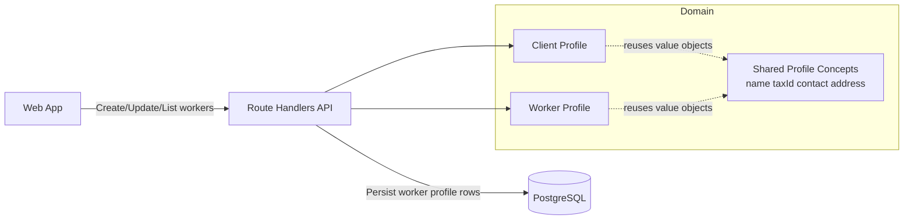
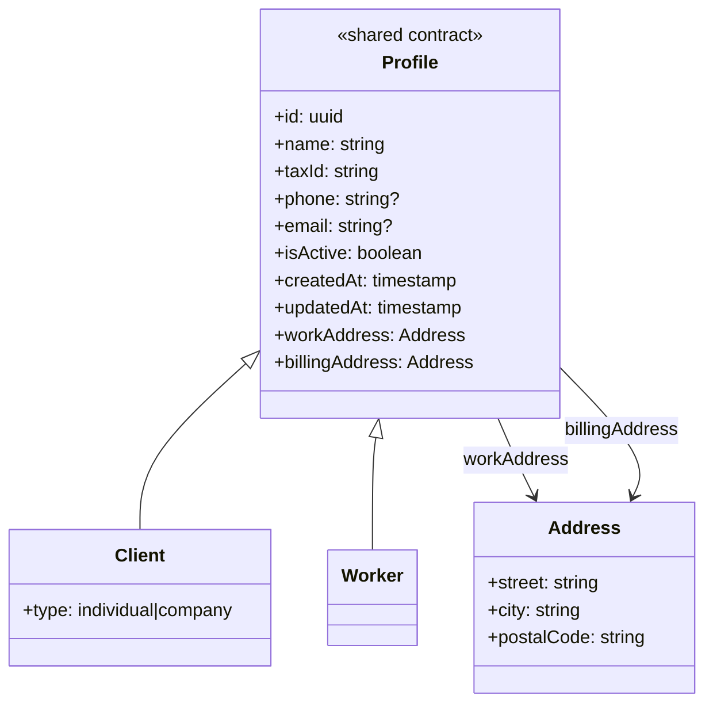

## Context

The proposal introduces worker profiles to store invoice issuer identity data now, while remaining compatible with future authentication work. The current system already models structured work and billing addresses for clients, and this design extends that pattern to workers without introducing auth flows in this iteration.

ADR inventory and in-force set review:
- Files in `docs/adr/`: `.gitkeep`, `0001-adopt-bootstrap-monorepo-stack.md`
- Supersession graph: no ADR declares a `Supersedes` relationship
- In-force ADRs: `0001-adopt-bootstrap-monorepo-stack.md` (accepted, not superseded)

Design constraints from in-force ADR-0001:
- Keep the TypeScript monorepo architecture and current Next.js + Route Handlers approach.
- Keep relational persistence in PostgreSQL and evolve schema through migrations.
- Prefer low-complexity, incremental changes compatible with current stack.

Stakeholders:
- Primary user: your father (invoice issuer today)
- Future users: workers that may later authenticate into the system
- Maintainers: developers evolving domain and API contracts over time

## Architecture Diagrams

UML entity view for the model from this change forward:

Assumptions:
- Worker profile data will be consumed by future invoice flows as issuer source-of-truth.
- Authentication identity linkage is intentionally deferred.

## Goals / Non-Goals

**Goals:**
- Add a first-class worker profile model for issuer-related data.
- Reuse existing structured address semantics (work and billing) to avoid divergent models.
- Keep room for future auth integration by reserving stable worker identity concepts.
- Minimize risk by using incremental schema and API evolution aligned with existing patterns.

**Non-Goals:**
- Implementing authentication, authorization, or session management.
- Finalizing class-table inheritance as a mandatory persistence strategy in this iteration.
- Delivering invoice generation changes in this artifact set.

## Decisions

1. Introduce a dedicated `workers` persistence model instead of overloading `clients`.
- Rationale: Workers and clients represent different business actors with different lifecycle semantics, even if they share many fields.
- Alternatives considered:
  - Reuse `clients` table with role/type flags. Rejected because it conflates customer and issuer concepts and complicates future auth linkage.
  - Introduce full class-table inheritance now. Rejected for this iteration due to migration and coupling overhead before auth requirements are concrete.

2. Reuse structured address field conventions from clients for workers (`street`, `city`, `postalCode`, plus billing fields).
- Rationale: This keeps validation/UI/service logic consistent and supports invoice-ready billing data.
- Alternative considered: Single free-text address for workers. Rejected due to the same ambiguity already solved in client-management.

3. Introduce a shared parent `Profile` domain contract for shared fields and behavior, while avoiding a physical shared base table in this iteration.
- Rationale: Captures common semantics once (name, tax/contact fields, active/timestamps, work/billing addresses) and reduces duplication without forcing immediate schema inheritance complexity.
- Alternative considered: Immediate physical base table (`profiles`) with FK-based subtypes. Rejected as premature until auth requirements and worker/client divergence are clearer.

4. Define worker CRUD semantics analogous to clients (create, read, update, archive), including active-state handling.
- Rationale: Aligns user and developer mental model with existing platform behavior and reduces implementation risk.
- Alternative considered: Hard-delete workers. Rejected to preserve auditability and future historical invoice consistency.

5. Preserve auth-readiness by reserving identity-oriented fields and integration points, while making auth explicitly out of scope.
- Rationale: Avoids repainting domain contracts later while keeping this change focused.
- Alternative considered: Add placeholder auth credentials now. Rejected to avoid partial security designs and accidental exposure.

6. Build a dedicated workers management section in the frontend that reuses existing client-management UI patterns and behaviors.
- Rationale: Workers are an operational entity that needs first-class maintenance screens, and client UI patterns already solve most CRUD interactions and validation UX.
- Alternative considered: Keep worker management API-only for now. Rejected because maintainers need practical UI access to maintain worker records.

7. Defer invoice issuer snapshot decisions to the budgets/invoices change and keep worker profiles as the issuer source model for now.
- Rationale: Snapshot strategy belongs to invoice domain design and should be decided together with budget/invoice requirements.
- Alternative considered: Defining snapshot behavior now. Rejected to keep this change focused on worker profiles.

## Risks / Trade-offs

- [Model duplication risk] Shared fields may be duplicated across client and worker code in the short term. -> Mitigation: define shared value objects/contracts first and schedule extraction tasks explicitly.
- [Premature abstraction risk] Overgeneralizing shared profile structures could hinder future auth decisions. -> Mitigation: keep shared contracts minimal and defer hard DB inheritance decisions.
- [Contract drift risk] Worker endpoints may diverge from client naming and validation style. -> Mitigation: align field names and validation semantics with existing client patterns in specs and tasks.
- [Historical document risk] If invoice flows later read live worker fields, historical documents may become inconsistent. -> Mitigation: define snapshot/versioning rules explicitly in the dedicated budgets/invoices change.

## Migration Plan

1. Create worker profile specifications (new worker capability + client-management delta) to lock required behavior and shared terminology.
2. Add worker persistence schema via additive migration(s), including structured work and billing fields and active/timestamp columns.
3. Implement API contracts and validation for worker CRUD flows.
4. Implement web-level worker profile management surfaces needed for administrative maintenance.
5. Add verification for create/update/archive and data-shape consistency with structured addresses.

Rollback strategy:
- For application-level issues before dependent features launch, disable worker UI/routes while retaining additive database changes.
- Avoid destructive schema operations in initial rollout; defer irreversible cleanup until worker flows are proven stable.

## Open Questions

- Should v1 support only one worker profile (father-only bootstrap) or multiple workers from day one?
- Should worker `email` be required now for future auth compatibility, or optional until auth is introduced?
- Do we need both `legalName` and `displayName` in worker contracts now, or only one name field initially?
- Should `client-management` be modified only for terminology alignment, or should it also define normative shared-profile invariants?
- Should the shared parent profile contract remain domain-only, or should a shared persistence model be introduced in a later refactor once auth requirements are concrete?
