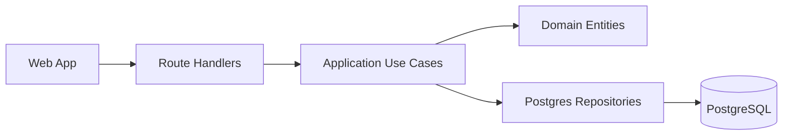
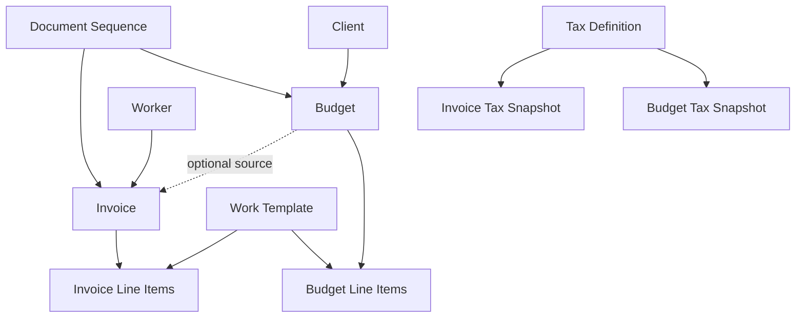

## Context

This change introduces the first commercial document foundation in the platform: structured budgets and invoices, reusable work templates, tax configuration with snapshot behavior, and numbering state management.

Current state:
- Clients and workers are already first-class profiles and form the source data for document parties.
- The vision currently mentions rich-text editing for budgets/invoices, but product direction now favors structured line items with optional notes.
- Navigation currently includes clients/workers but not budget/invoice/settings sections.

Constraints from in-force ADRs:
- ADR inventory: `0001-adopt-bootstrap-monorepo-stack.md`, `0002-enforce-layer-boundaries-and-transport-contracts.md`.
- Supersession graph: neither ADR supersedes another (`0002` has `Supersedes: none`).
- In-force ADR set: `0001`, `0002` (both accepted, not superseded).
- Design must preserve layered boundaries and flat transport contracts while keeping additive Postgres migrations.

Stakeholders:
- Primary operator: your father (low-friction data entry on laptop/iPad).
- Maintainers: future contributors extending document export, accounting, and automation workflows.

## Architecture Diagrams

Canonical full class diagram: `/docs/domain-class-diagram.md`.

Assumptions:
- Budget and invoice line items are single-row templates in this phase (no bundles).
- Tax is selected from definitions but materialized into each document snapshot.

Open diagram question:
- Whether invoice issuance should allocate number at draft creation or only at issue time.

## Goals / Non-Goals

**Goals:**
- Model budgets and invoices as structured commercial documents with line items and computed totals.
- Preserve historical correctness through snapshot/materialization rules (tax/template/party data used at creation time).
- Support configurable numbering with auto-increment behavior and manual adjustment.
- Keep budgets and invoices as separate capabilities while sharing reusable concepts.
- Extend app navigation and API surfaces for budget/invoice/settings management.

**Non-Goals:**
- PDF generation/rendering.
- Rich text editing as the primary authoring model.
- Payment reconciliation flows.
- OCR/email ingestion for external invoices.

## Decisions

1. Keep `budget` and `invoice` as separate aggregates with shared building blocks.
- Rationale: they are similar but have different semantics (delivered date vs issued lifecycle, optional budget linkage, issuer concerns, numbering rules).
- Alternatives considered:
  - Single generic `document` aggregate with `type` discriminator: rejected for this phase because divergent lifecycle semantics would be hidden and harder to evolve safely.

2. Use line-item-first authoring with optional notes, not rich-text-first bodies.
- Rationale: supports low-friction entry, consistent totals, and deterministic exports.
- Alternatives considered:
  - Rich-text editor with embedded pricing markers: rejected due to validation complexity and fragile downstream automation.

3. Materialize selected tax, template content, and party data onto document snapshots.
- Rationale: historical records must remain stable when system-level definitions change later.
- Alternatives considered:
  - Live references only: rejected because edits to tax rates/template rows/client/worker data would retroactively alter existing documents.

4. Introduce a dedicated configuration/catalog capability for tax definitions, work templates, and numbering state.
- Rationale: keeps business defaults manageable and reusable from document flows while respecting bounded responsibilities.
- Alternatives considered:
  - Store defaults directly in each document form state only: rejected because it does not provide reusable shared defaults across documents.

5. Model numbering as sequence state by document type and scope rather than ad-hoc counters in UI state.
- Rationale: enables budget global increments and invoice year-scoped increments while allowing controlled manual adjustments.
- Alternatives considered:
  - One global config integer per document kind without scope model: rejected because invoice year-based numbering cannot be represented cleanly.

6. Preserve existing layered architecture and flat transport payloads for new APIs.
- Rationale: aligns with ADR-0002 and keeps use cases testable via outbound ports.
- Alternatives considered:
  - Expose nested domain objects directly over REST: rejected due to contract coupling and mismatch with current API standards.

7. Use a single JobItem entity for both budgets and invoices, not separate BudgetJobItem/InvoiceJobItem classes.
- Rationale: job items have identical structure and behavior across both document types today. If divergence arises later (e.g., invoice items need approval status), refactoring to separate classes is straightforward.
- Alternatives considered:
  - Separate BudgetJobItem and InvoiceJobItem classes: rejected as premature abstraction with zero current benefit.
  - Parent JobItem class with subclasses: rejected for same reason—adds complexity without justification.

## Attribute Model Decisions

### Parent abstraction: CommercialDocument (domain-level)

Use a shared parent abstraction in domain/application code only (not a mandatory physical base table in this phase).

Parent attributes:
- `id`: string (uuid)
- `number`: string (human-visible document number)
- `clientId`: string (uuid)
- `clientSnapshot`: object (materialized client billing/identity fields used by this document)
- `workerId`: string (uuid)
- `workerSnapshot`: object (materialized issuer/worker identity and billing fields)
- `notes`: string | null
- `taxSnapshot`: object | null (materialized tax name/rate/behavior)
- `subtotalAmount`: number (decimal)
- `taxAmount`: number (decimal)
- `totalAmount`: number (decimal)
- `createdAt`: Date
- `updatedAt`: Date

### Budget attributes (extends CommercialDocument)

Budget-specific attributes:
- `deliveredAt`: Date | null (manually entered date when budget is delivered/sent)

### Invoice attributes (extends CommercialDocument)

Invoice-specific attributes:
- `issuedAt`: Date | null
- `sourceBudgetId`: string | null (optional relationship for invoice-from-budget)

### JobItem attributes

Job items represent work/services on a budget or invoice. All job items share the same structure regardless of document type.

JobItem attributes:
- `id`: string (uuid)
- `commercialDocumentId`: string (uuid)
- `position`: number (ordering within document)
- `title`: string
- `description`: string | null
- `quantity`: number | null (optional quantity multiplier)
- `unitPrice`: number | null (optional per-unit price)
- `totalPrice`: number | null (optional total for this line)

### Numbering and sequence linkage

- `number` is assigned via `DocumentSequence` allocation at document creation time.
- Budget sequence scope: global (single stream).
- Invoice sequence scope: per year (`YYYY` scoped stream).
- Sequence values remain manually adjustable via settings, but existing document numbers are immutable once assigned.

## Risks / Trade-offs

- [Snapshot payload growth] Document records can become heavier due to embedded snapshots. -> Mitigation: snapshot only required fields for rendering/accounting correctness.
- [Numbering race conditions] Concurrent creations could produce duplicate numbers if allocation is naive. -> Mitigation: allocate numbers transactionally in persistence layer.
- [Premature over-modeling] Building shared abstractions too early could slow delivery. -> Mitigation: keep shared parts minimal (line item, tax snapshot, sequence) and evolve incrementally.
- [UX complexity creep] Settings/catalog screens may become too technical for non-technical users. -> Mitigation: keep v1 settings narrow and action-oriented (taxes, saved jobs, next number).

## Migration Plan

1. Add additive persistence structures for budgets, invoices, line items, tax definitions, work templates, and document sequences.
2. Implement domain entities/value objects and outbound ports following existing layering rules.
3. Implement API validators/mappers/openapi contracts with flat transport shapes.
4. Add budget/invoice UI list + form flows and catalog/settings management pages.
5. Extend app navigation shell links to include budgets, invoices, and settings routes.
6. Verify key invariants: sequence allocation, snapshot immutability, optional budget->invoice linkage, and totals consistency.

Rollback strategy:
- Disable new routes via app-level navigation if issues appear.
- This change intentionally uses a hard cutover for naming/sequence consolidation (including retiring legacy structures after backfill), so rollback is operationally handled via backups/snapshots rather than preserving legacy tables indefinitely.

## Open Questions

- Should v1 line items include quantity/unit fields, or remain title/description/price only? (Current decision for this change: title/description/unitPrice only.)
- Should one budget support multiple invoices from day one?
- Do we need separate tax behaviors (included vs added) in v1, or only added-percentage taxes? (Current decision for this change: added-percentage taxes only.)
- Does this change require a new ADR for long-term snapshot/numbering policy, or can it remain captured in change-level design for now?
