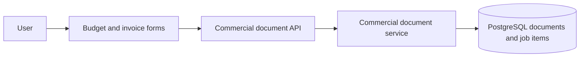

## Context

Work Templates are not being used and add distractions and complexity instead of solving the intended document-creation purpose. The recently introduced commercial-document duplication flow now covers reuse of a previous budget or invoice, making a separate reusable line-item preset catalog unnecessary. The feature currently spans the Next.js API routes, OpenAPI contract, commercial-document application service and composition root, domain/application/infrastructure layers, PostgreSQL migration registry and SQL, settings catalog, budget/invoice line-item form, hooks, translations, tests, README, and domain diagram. Work Templates are materialized into document line items, so removing the preset source does not require changing the persisted budget or invoice line-item shape.

The repository uses forward-only SQL migrations and documents that database rollback is unsupported. The removal is intentionally destructive: existing `work_templates` rows are discarded. Archived OpenSpec changes are historical records and remain unchanged.

## Architecture Diagrams

The relevant post-change flow is deliberately smaller:

Assumption: job items already contain materialized title, description, quantity, and price values and do not require a foreign key to `work_templates`.

## Goals / Non-Goals

**Goals:**

- Remove every active runtime and source-level Work Template dependency.
- Keep budgets and invoices fully usable through direct line-item entry.
- Drop the Work Template database table and remove its migration registration.
- Remove tests, docs, diagrams, translations, routes, contracts, and UI that exist only for the feature.
- Make the resulting application internally consistent with no compatibility shims, aliases, deprecated endpoints, or dead code.

**Non-Goals:**

- Preserve existing Work Template records or provide an export/import path.
- Modify archived OpenSpec history.
- Introduce a replacement reusable-template feature.
- Change the independent budget/invoice line-item data model or document totals behavior.

## Decisions

### Delete the capability rather than deprecate it

Remove routes, types, services, entities, repositories, components, hooks, and tests outright. Deprecation or compatibility wrappers would retain the exact tech debt this change is intended to eliminate. External consumers are explicitly out of scope.

### Use a destructive forward migration

Add one current SQL migration that drops `work_templates`, while preserving the original create-table migration and its registry position as immutable migration history. Fresh databases may create and then drop the retired table; existing databases apply only the new drop migration. This matches the repository's forward-only operational model and ensures deployed databases converge to the intended schema. No rollback migration or compatibility view will be added.

### Preserve materialized document data

Remove only template selection and auto-fill from `JobItemForm`. Existing `job_items` remain unchanged because they store copied values, not template references. This avoids an unrelated document-data migration while satisfying complete capability removal.

### Update active documentation only

Remove current README and diagram references. Historical archived OpenSpec artifacts remain untouched by explicit decision, and the new removal change records that distinction rather than rewriting history.

### Verify through repository-wide active-reference checks

Use targeted searches plus TypeScript, tests, build, and OpenSpec verification to confirm no active identifier, route, translation key, import, or UI text remains. Archived change directories are excluded from the “no active references” assertion.

## Risks / Trade-offs

- [Risk] Applying the migration permanently deletes existing template records. -> Mitigation: make the destructive behavior explicit, test against a representative database, and require deployment owner confirmation before production migration.
- [Risk] Removing form auto-fill may expose assumptions in line-item tests or shared hooks. -> Mitigation: update focused form and commercial-document tests and run the full test, check, and build suite.
- [Risk] A missed string or indirect import can leave dead behavior or fail the build. -> Mitigation: search identifiers and user-facing terms across active paths, then rely on type checking and build validation.
- [Risk] Archived history still contains the old capability and may confuse broad searches. -> Mitigation: document the intentional history boundary and scope audits to active code, docs, specs, tests, and generated artifacts.

## Migration Plan

1. Remove runtime and source references, simplify line-item forms, and update active documentation.
2. Preserve all previously applied migration files and registrations, then add and register the forward migration that drops `work_templates` after the latest existing migration.
3. Run focused tests, `pnpm test`, `pnpm check`, `pnpm build`, and OpenSpec verification.
4. Apply the destructive SQL migration to each environment before or alongside deployment according to the repository's manual migration process.

Rollback is not supported because both the database change and the application contract are intentionally destructive. Recovery requires restoring the database from an external backup and reverting the deployment as an operational emergency, not a compatibility design.

## Open Questions

None. The scope, destructive data policy, history boundary, and worktree/branch have been confirmed.
