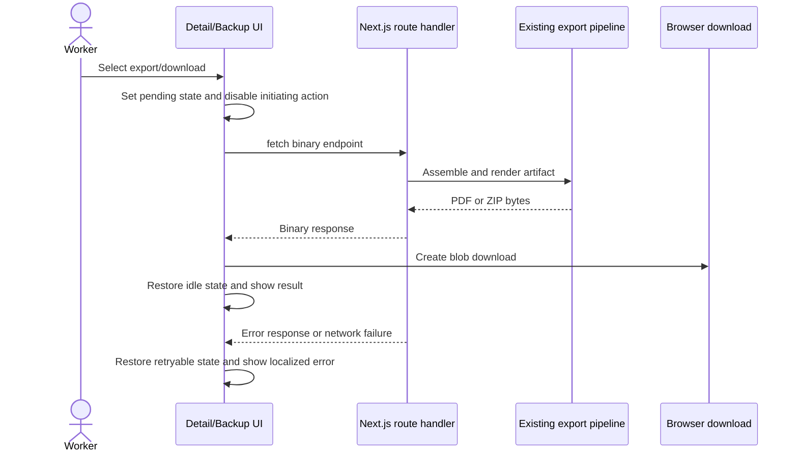

## Context

The web application is a Next.js client/server application with client-side React components invoking authenticated route handlers. Existing mutations already expose local `loading`/`submitting` state, disable controls, and use localized labels such as `Saving...`. Google Drive synchronization has a multi-request progress loop with `syncing`, remaining-document feedback, completion details, and failure reporting.

The missing feedback is concentrated in binary download actions. Budget and invoice PDF exports currently fetch a generated PDF without any local pending or error state. The complete ZIP backup currently uses browser navigation, which starts the request but gives the React UI no reliable completion or failure boundary. The change must improve observability without changing PDF/ZIP contents, API response formats, authentication, persistence, or cloud-sync resumability.

The current accepted ADRs constrain this design as follows:

- The application remains a TypeScript/pnpm Next.js monorepo.
- HTTP route handlers remain adapters, while export orchestration and infrastructure boundaries remain unchanged.
- Authentication remains centralized in middleware.
- Existing document and export contracts remain the source of truth for generated artifacts.

## Architecture Diagrams

The useful view is a lightweight dynamic flow for client-owned binary downloads:

Assumptions:

- PDF and ZIP generation normally completes within the existing request lifecycle; this change does not introduce an asynchronous export-job queue.
- The browser can hold the generated binary in memory long enough to trigger the existing download behavior.
- Cloud sync remains a bounded, client-driven batch workflow and only receives UI consistency improvements.

## Goals / Non-Goals

**Goals:**

- Make PDF export visibly pending from request start through blob download or failure.
- Make local ZIP backup download client-managed so it can expose preparation and failure states.
- Prevent duplicate PDF, backup, and conflicting cloud-sync requests from the relevant controls.
- Preserve current generated filenames, response headers, archive contents, and stateless server behavior.
- Use localized, accessible status text and existing Lucide/Tailwind conventions.
- Keep feedback scoped to the initiating document or Backup & Export panel rather than blocking the whole application.

**Non-Goals:**

- No background job, queue, polling endpoint, persistent operation table, or resumable local backup protocol.
- No percentage progress bar for PDF generation or ZIP assembly when the server does not expose measurable progress.
- No redesign of all loading states or route transitions in this iteration.
- No changes to cloud-provider APIs, export-state persistence, database schemas, or authentication.
- No change to the contents or format of generated PDFs, workbooks, or ZIP archives.

## Decisions

### 1. Use local state for single-document PDF exports

Budget and invoice detail pages will each own an export-pending state and an export error state. The existing inline button is the correct feedback location because the operation is initiated there and does not invalidate the displayed document. The button will be disabled while pending, show a localized pending label and spinner, and return to idle after the browser download has been triggered or an error has been handled.

Alternative considered: a full-page overlay. Rejected because it blocks document viewing for an action that does not change page state and would be inconsistent with existing save/duplicate behavior.

### 2. Use `fetch` plus blob download for the local ZIP backup

The Backup & Export panel will request `/api/backup/download` explicitly, validate the response, read the blob, and trigger a download using an object URL. This creates a deterministic `try/catch/finally` boundary for the pending state and lets the panel show a localized error without changing the server route or ZIP response.

Alternative considered: retain `window.location.assign`. Rejected because navigation does not provide the component with response status, completion, or failure callbacks.

### 3. Keep progress scope operation-specific

PDF exports use button-local feedback. ZIP backup and Google Drive sync use the Backup & Export panel's operation area. While either multi-document operation is active, conflicting backup actions are disabled. The UI will not add a global loading overlay or global operation store in this iteration.

Alternative considered: a global async-operation manager. Deferred because the current scope contains only a few related controls, and a global manager would add lifecycle complexity without enabling background work or cross-route persistence.

### 4. Use indeterminate feedback where progress is unavailable

PDF rendering and ZIP assembly do not expose server-side progress, so the UI will use a spinner and truthful wording such as `Generating PDF...` or `Preparing backup...`. Google Drive sync will retain its existing remaining-document feedback because that workflow already reports batch progress.

Alternative considered: percentage progress for PDF/ZIP operations. Rejected because it would imply precision the current APIs cannot provide.

### 5. Preserve existing localization and accessibility conventions

New labels and errors will be added to all supported locale message files. Pending controls and status regions will use semantic status/busy attributes, meaningful text, and disabled behavior. Animation is supplementary and must not be the only indication of progress.

## Risks / Trade-offs

- [Risk] Reading large ZIP/PDF responses into a browser blob temporarily increases client memory use. → Mitigation: preserve the existing binary response and use the same approach only for user-triggered downloads; revisit a job-based download if backup size becomes problematic.
- [Risk] A download may have been handed to the browser while the page does not receive a meaningful filesystem completion event. → Mitigation: define completion as successful response plus blob download trigger, which is the observable boundary available to the web app.
- [Risk] Users may navigate away while an operation is pending. → Mitigation: keep operation state component-local and restore it in `finally`; do not add misleading cross-page global state.
- [Risk] Repeated controls may drift in wording or disabled styling. → Mitigation: reuse existing button conventions and add focused tests for the three primary flows.
- [Risk] A failed HTTP response may contain a JSON error body instead of binary data. → Mitigation: check `response.ok` before reading the blob and surface a localized fallback error.

## Migration Plan

1. Add and test the loading-feedback, PDF-export, ZIP-download, and cloud-sync UI behavior in the change worktree.
2. Run focused tests, then the repository validation commands and OpenSpec verification.
3. Deploy normally; no migration or feature-flag rollout is required.
4. Rollback is a client-code revert. Existing API routes and generated artifact formats remain compatible during rollback.

## Open Questions

- If real-world backup generation exceeds request or browser memory limits, should a later change introduce a persistent export job and downloadable artifact lifecycle? This iteration intentionally leaves that question open.
- Should route-transition loading feedback be added later? It is outside this change because the current evidence points to action-specific export and backup feedback as the higher-value gap.
